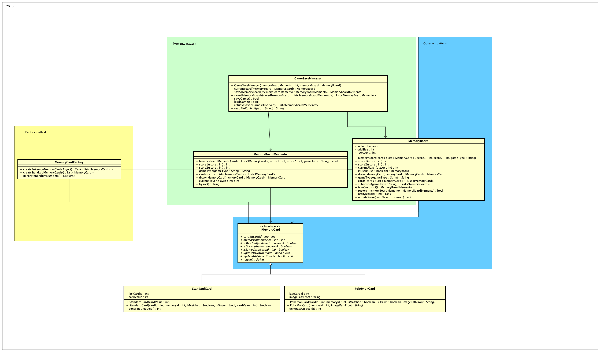

# Startdocument voor een design patterned memory game

Startdocument van **Michel Disbergen, Steffan van der Werf en Stefan Meijer**.

## Opdracht omschrijving

Het idee voor onze Design Patterns opdracht is een webgebaseerde memory game, waarbij twee spelers deelnemen en klassieke spelregels volgen. De kaartinformatie wordt opgehaald vanuit een API via meerdere API-aanroepen. Er moet een score bijgehouden worden en als alle koppel kaartjes zijn gevonden moet er een winnaar "uitgeroepen" worden. 

### Functionaliteiten
- Spel opslaan;
- Spel inladen;
- Random patroon van kaartjes op de borden;
- Bijhouden van de score;
- Melding welke speler aan de beurt is;
- Kaartjes informatie inladen via de API.
- Kaartjes informatie vanuit nummers maken.

## Design patterns 
In dit hoofdstuk word omschreven welke Design pattern voor welke functionaliteit gaat zorgen

### Factory pattern
De factory pattern gaat gebruikt worden om de kaartjes en het bord aan te maken. Hierdoor zorgen we dat de afhankelijkheid om kaartjes te maken puur bij de factory ligt en niet bij het de bord of card methode die ook andere verantwoordelijkheden krijgt

### Memento pattern
De design pattern memento willen we gebruiken om een spel op te kunnen slaan en in te laden. Hierdoor kunnen we een spel midden tijdens het spelen opslaan en later verder gaan

### Observer pattern
In een memory game wil je kaarten kunnen selecteren en controleren of de geselecteerde kaarten overeenkomen. Het Observer-pattern wordt gebruikt om deze kaartinteracties te beheren. door de observer te gebruiken kunnen we checken of een kaartje geklikt is en of de 2 geklikte kaartjes ook matchen.

## Klassendiagram

## MoSCoW
In de dit hoofstuk word hieronder de functionaliteiten via de MoSCoW methode verwerkt.

### Must haves
- er moet een spel opgeslagen kunnen worden
- kaartjes worden aangemaakt via factory method
- kaartjes moeten kunnen worden omgedraait 
- kaartjes moeten worden gematched
### Should haves
- score word bijgehouden
- beurt moet worden bijgehouden
- borden worden random gegenereerd
### Could haves
- opgeslagen borden word volgorde van kaartjes onthouden
### Won't haves
- word rekening gehouden met als er geen internet beschikbaar is voor de api calls